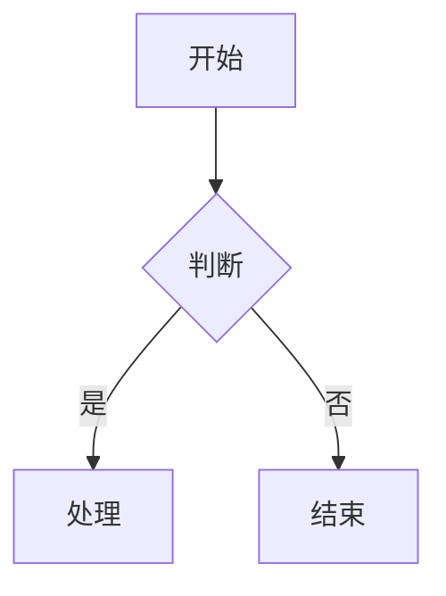

# Markdown To Doc

一款免费的在线 Markdown 转 Word 文档工具，专为科研论文写作优化。支持实时预览、LaTeX 数学公式（Word 原生 OMML 格式）、一键复制到剪贴板或导出 .docx 文件。

## 功能特性

### 编辑与预览

- **实时预览** — 左侧编辑 Markdown，右侧即时渲染 Word 兼容格式
- **一键复制** — 复制富文本到剪贴板，粘贴到 Word 保留完整格式
- **导出 .docx** — 生成标准 Word 文档直接下载，公式以 Word 原生格式呈现
- **同步滚动** — 编辑器与预览面板同步滚动
- **自动保存** — 内容自动保存到浏览器本地存储
- **暗色模式** — 支持亮色/暗色主题切换
- **移动端适配** — 响应式布局，移动端编辑/预览 Tab 切换
- **隐私安全** — 纯前端运行，数据不离开浏览器

### Markdown 语法

- **完整 GFM 语法** — 标题、加粗、斜体、删除线、列表、表格、代码块、引用、分割线等
- **任务列表** — `- [ ]` 未完成 / `- [x]` 已完成
- **高亮标记** — `==重点内容==` 黄色高亮显示
- **文件上传** — 支持上传 .md / .markdown / .txt 文件
- **图片粘贴** — 直接 Ctrl+V 粘贴截图，自动嵌入
- **图片拖拽** — 拖拽图片文件到编辑器
- **预设模板** — 内置基础语法、表格、代码块、数学公式等示例模板

### LaTeX 公式

支持 4 种公式写法，导出为 Word 原生 OMML 格式（分数、根号、积分、求和、矩阵等）：

| 写法 | 类型 | 示例 |
|---|---|---|
| `$...$` | 行内 | `$E = mc^2$` |
| `\(...\)` | 行内 | `\(E = mc^2\)` |
| `$$...$$` | 块级 | `$$\int x dx$$` |
| `\[...\]` | 块级 | `\[\int x dx\]` |

### 代码与图表

- **代码语法高亮** — 自动检测语言，预览中显示彩色代码（highlight.js）
- **Mermaid 流程图** — 支持流程图、时序图、类图等（预览渲染）

### 论文排版（导出 Word）

- **A4 纸张** — 210mm × 297mm，纵向
- **标准页边距** — 上下 2.54cm，左右 3.17cm
- **中文字体** — 正文宋体 + Times New Roman，标题黑体
- **1.5 倍行距** — 学术论文标准
- **自动目录** — 根据 # 标题自动生成，打开 Word 后右键更新即可
- **页码** — 页脚居中显示
- **脚注** — `[^1]` 语法，自动生成脚注

### 键盘快捷键

| 快捷键 | 功能 |
|---|---|
| `Ctrl+Shift+C` | 复制到剪贴板 |
| `Ctrl+S` | 导出 .docx |
| `Ctrl+K` | 切换主题 |
| `Tab` | 插入缩进 |

## 技术栈

- React 19 + TypeScript
- Vite
- Tailwind CSS 4
- marked（Markdown 解析）
- KaTeX（LaTeX 公式渲染）
- markdown-docx（Markdown 转 Word，含 OMML 公式支持）
- Mermaid（流程图渲染）
- highlight.js（代码语法高亮）

## 快速开始

```bash
# 安装依赖
npm install

# 启动开发服务器
npm run dev

# 构建生产版本
npm run build

# 预览生产构建
npm run preview
```

## 使用说明

1. 在左侧编辑区输入 Markdown 内容
2. 右侧预览区实时显示渲染效果
3. 点击「复制」将富文本复制到剪贴板，可直接粘贴到 Word
4. 点击「下载 .docx」生成 Word 文档下载（公式以 Word 原生格式呈现）
5. 点击「模板」加载预设示例

### Mermaid 流程图示例

````markdown

````

### 脚注示例

```markdown
这是一个需要引用的结论[^1]。

[^1]: 参考文献：张三, 《流体力学》, 2024.
```

## 许可证

Copyright © 2026 Zevan❤️且试新茶趁年华. All Rights Reserved.
